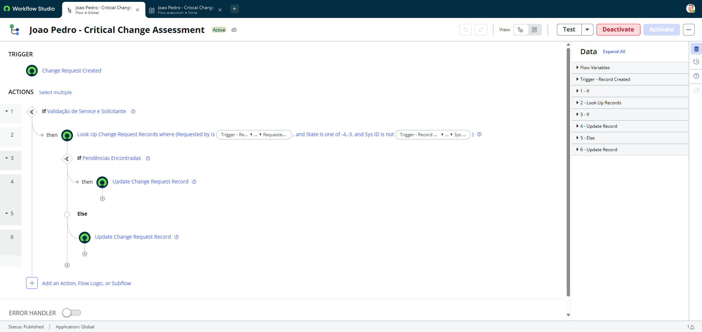
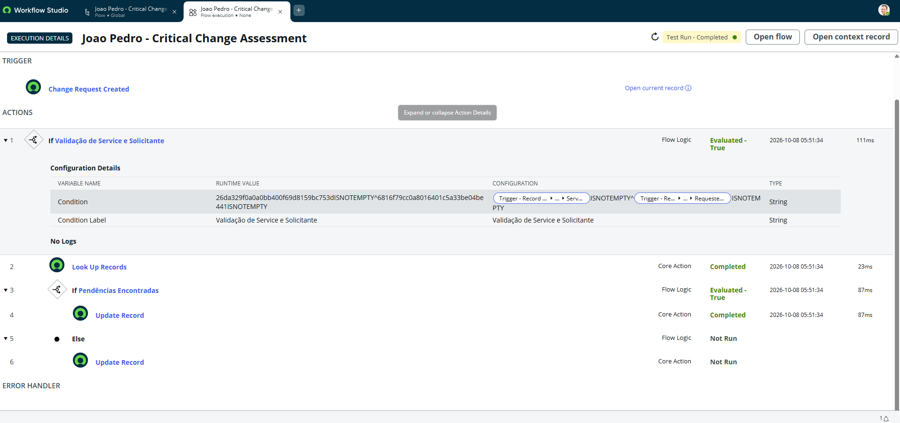
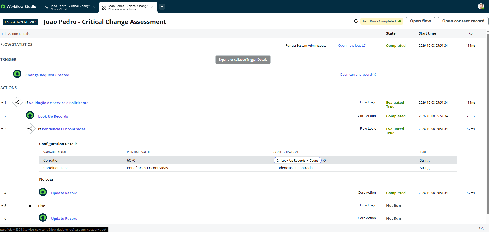

# ServiceNow — Avaliação e Roteamento de Mudanças Críticas (Critical Change Assessment)


Fluxo automatizado desenvolvido no **Flow Designer** do ServiceNow para avaliar, validar pendências e processar Solicitações de Mudança Críticas (`change_request`). A solução otimiza os processos de Gestão de Serviços de TI (ITSM), garantindo a verificação de regras de negócio antes do prosseguimento do fluxo.

---

## 📌 Visão Geral do Projeto

Na gestão de TI corporativa, mudanças críticas exigem validação rigorosa de solicitantes e serviços envolvidos para evitar riscos operacionais. Este projeto automatiza o ciclo de avaliação de mudanças, garantindo conformidade e integridade dos dados registrados.

### Principais Funcionalidades
- **Gatilho de Execução:** Disparado automaticamente na criação de um registro na tabela `change_request`.
- **Validação de Serviço e Solicitante:** Valida se os campos de serviço e solicitante estão devidamente preenchidos.
- **Busca e Verificação de Pendências:** Consulta registros associados para identificar se existem pendências ativas.
- **Atualização Automática:** Atualiza o status e os campos do registro de mudança de acordo com o resultado das verificações.

---

## 📷 Demonstração Visual

### Estrutura Lógica do Fluxo (Workflow Studio)


### Execução do Teste no ServiceNow



## 🛠️ Arquitetura e Componentes

- **Plataforma:** ServiceNow (Workflow Studio / Flow Designer)
- **Tabela Principal:** `change_request`
- **Tipo de Artefato:** Remote Update Set (`sys_remote_update_set`)

```text
[Solicitação de Mudança Criada] 
              │
              ▼
   [Validação de Service e Solicitante]
              │
              ▼
   [Consulta de Registros / Pendências]
              │
    ┌─────────┴─────────┐
    ▼                   ▼
[Com Pendências]    [Sem Pendências]
    │                   │
    └─► Atualiza        └─► Atualiza
        Registro            Registro
